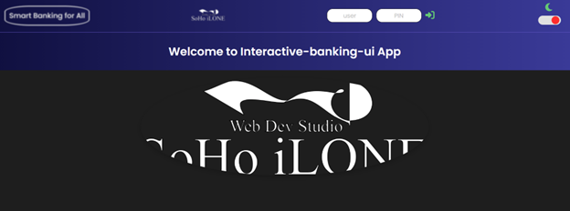

# 💳 Interactive Banking UI

**Interactive Banking UI** is an educational web application that simulates basic online banking features. Built with plain HTML, CSS, and JavaScript, the app is designed as a front-end development and UI design practice project.

## Demo

You can view a live demo of this project [here](https://d-vokic.github.io/interactive-banking-ui/).

## Table of Contents

- [Interactive Banking UI](#interactive-banking-ui)
  - [Demo](#demo)
  - [Table of Contents](#table-of-contents)
  - [Features](#features)
  - [Technologies Used](#technologies-used)
  - [Project Structure](#project-structure)
  - [Getting Started](#getting-started)
  - [Prerequisites](#prerequisites)
  - [How to Run](#how-to-run)
  - [Usage](#usage)
  - [Built with](#built-with)
  - [Contributing / Support](#contributing--support)
  - [Author](#author)
  - [License](#license)
  - [Acknowledgments](#acknowledgments)

## Features

- User login interface
- Display of transactions (deposits and withdrawals)
- Account balance visualization
- Simulated money transfers
- Auto logout after a period of inactivity
- Dynamic DOM manipulation using JavaScript
- Clean and responsive user interface

## 🛠️ Technologies Used

- ✅ HTML5
- ✅ CSS3 (Flexbox & Grid layout)
- ✅ JavaScript (Vanilla JS – no frameworks)

## 📁 Project Structure

interactive-banking-ui/
├── css/
- │ └── style.css
├── img/
- │ ├── bank.png
- │ └── soho.webp
├── js/
- │ └── script.js
├── .gitignore
├── .prettierrc
├── index.html
├── LICENSE.md
├── screenshot.png
└── README.md

### Getting Started

These instructions will get you a copy of the project up and running on your local machine for development and testing purposes.

### Prerequisites

What things you need to install the software and how to install them:

- A modern web-browser (Chrome, Firefox, Safari, Edge)

### 🔧 How to Run Locally

1. Clone the repository.
2. Navigate to the project directory:
3. Open `index.html` in your browser.

## Usage

1. Use the play/pause button to play or pause the track.
2. Use the next and previous buttons to change tracks.

## Built With

- [HTML](https://developer.mozilla.org/en-US/docs/Web/HTML) - The markup language used
- [CSS](https://developer.mozilla.org/en-US/docs/Web/CSS) - The style sheet language used
- [JavaScript](https://developer.mozilla.org/en-US/docs/Web/JavaScript) - The programming language used

## Contributing / Support

-Contributions are welcome! If you find any issues or have suggestions for improvements, feel free to open an issue or create a pull request.
-If you're having any problem, please raise an issue on GitHub and the maintainers will help you out.

## Author

This project is maintained by Duško Vokić. You can reach out to me on [GitHub](https://github.com/D-vokic?tab=repositories) or [LinkedIn](https://www.linkedin.com/in/du%C5%A1ko-voki%C4%87-0337a2106) for any queries or suggestions.

## License

This project is licensed under the MIT License - see the [LICENSE.md](LICENSE.md) file for details

## Acknowledgments

- [Font Awesome](https://fontawesome.com/) - Used for icons.
- [Unsplash](https://unsplash.com/) - Source of album cover images.
- [GitHub Pages](https://pages.github.com/) - Hosting the project website.
